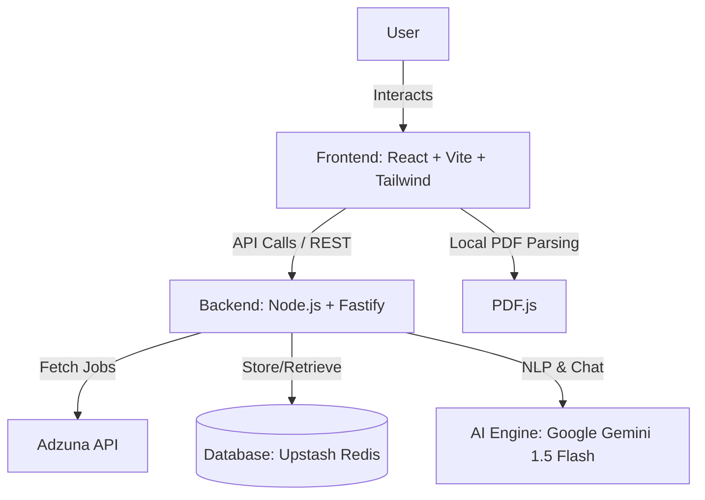

# HireSense AI - Intelligent Job Tracker 🚀

HireSense AI is a next-generation job tracking system that leverages Google Gemini AI to match resumes with job listings, track application statuses intelligently, and provide a conversational sidebar for job discovery.

## ✨ Features

- **Job Feed & Intelligent Scoring**: Automatic job matching using NLP and keyword analysis.
- **Resume Hub**: Smart extraction of skills and experience from PDF/TXT uploads.
- **AI Sidebar Assistant**: Conversational interface for complex filtering and product guidance.
- **Smart Application Tracker**: Interactive "Did you apply?" popup flow to ensure data consistency.
- **Dashboard & Timeline**: Professional view of all your job search activities.

---

## 🏗️ Architecture

---

## 🛠️ Setup Instructions

### Prerequisites
- **Node.js**: v18 or higher
- **Gemini API Key**: Obtain from [Google AI Studio](https://aistudio.google.com/)
- **Upstash Redis**: (Optional) For data persistence across restarts

### Backend Setup
1. `cd backend`
2. `npm install`
3. Create `.env` from `.env.example` and add your `GEMINI_API_KEY`.
4. `npm run start` (Runs on `http://localhost:3001`)

### Frontend Setup
1. `cd frontend/hiresense-ai`
2. `npm install`
3. `npm run dev` (Runs on `http://localhost:5173`)

---

## 🧠 AI Matching Logic

Our matching system uses a two-tier approach for speed and accuracy:
1. **Keyword Analysis**: A high-performance scoring algorithm runs on every job load, comparing job descriptions with the extracted resume text (skills, titles, experience).
2. **LLM Refinement**: The **Google Gemini 1.5 Flash** model powers the sidebar assistant, allowing for semantic queries like *"Find me remote roles requiring Python"* where literal keyword matching might fail.

**Efficiency**: We use `node-cache` or Redis to store match scores to minimize repeated computations, ensuring a smooth experience even with hundreds of jobs.

---

## 💡 Critical Thinking: Smart Popup Flow

**The Problem**: User friction in manual logging. Most users click "Apply" but forget to come back and mark it as "Applied".

**Our Solution**: 
- We hook into the `window.focus` event. 
- When a user clicks "Apply", we open the external link and set a local `PENDING_APPLICATION` flag.
- When the user switches back to our tab, a high-visibility modal triggers.
- **Design Decisions**:
  - *Non-Intrusive*: The modal can be closed if the user was just browsing.
  - *Comprehensive*: Includes "Applied Earlier" to handle duplicate or re-discovered jobs.
  - *Automated*: If the user says "Yes", we automatically capture the timestamp and metadata.

---

## 📈 Scalability & Performance

- **100 Jobs**: Handled instantly in-memory. The frontend uses virtualization for smooth scrolling.
- **10,000 Users**:
  - **Stateless Backend**: Fastify allows effortless horizontal scaling.
  - **Persistence**: Upstash Redis handles high-concurrency read/writes for session data.
  - **AI Caching**: We cache common AI responses to reduce API costs and latency.

---

## ⚖️ Tradeoffs & Improvement Goals

- **Tradeoff: Client-side PDF Extraction**: We parse PDFs in the browser to ensure privacy and reduce server processing costs. This makes the initial bundle slightly larger but saves massive backend resources.
- **Next Steps**:
  - Implement **Vector Embeddings** for semantic search across thousands of jobs.
  - Add **Authenticator** (Clerk/Auth0) for personalized multi-device sync.
  - Integrate with **Email** to track interview invites automatically.

---

## 📄 License
MIT

---
*Developed for the AI Job Tracker Challenge.*
